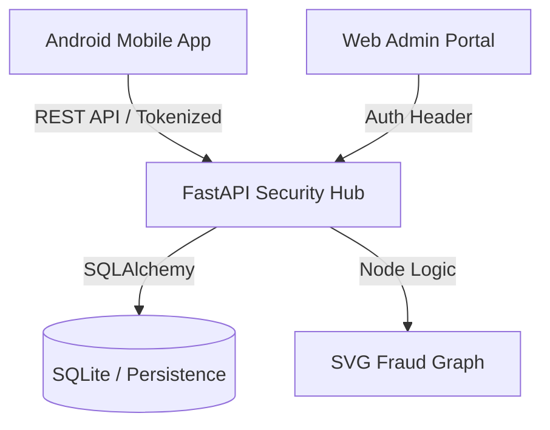

# SignalTrust: Community-Powered Fraud Protection

SignalTrust is a comprehensive caller-safety ecosystem designed to protect users from OTP fraud, phishing, and spam calls through real-time community intelligence and graph-based threat detection.

## 🏁 Final Prototype Overview

*Unified ecosystem showing real-time mobile protection and centralized admin intelligence.*

## 🚀 Key Features

### 📱 Android Mobile Application
*   **Safety Dashboard**: Real-time protection status and community safety statistics.
*   **Validated Search**: Reputation lookup for any phone number with privacy-first tokenization.
*   **Interactive Risk Scoring**: Detailed evidence-based results (Low, Medium, High risk) with recommended actions.
*   **Guided Reporting**: Anonymous multi-step reporting flow to contribute to the global safety network.
*   **Call Screening Integration**: Real-time interception and high-impact warning alerts for incoming fraudulent calls.

### 🛡️ Admin Security Portal
*   **Live Overview**: Centralized monitoring of global fraud trends and report volume.
*   **Fraud Graph Visualization**: Interactive SVG-based network graph showing relationships between suspicious callers and fraud clusters.
*   **Report Management**: Professional investigation drawer to confirm, reject, or audit community reports.
*   **Automated Intelligence**: Live backend synchronization ensuring the admin panel reflects the latest mobile reports within seconds.

---

## 📸 System Previews

| Mobile Safety Dashboard | Admin Security Overview |
|:---:|:---:|
|  |  |

| Interactive Fraud Graph | Real-time Call Warning |
|:---:|:---:|
|  |  |

---

## 🛠️ Technical Stack & Architecture

### System Architecture


*   **Mobile**: Jetpack Compose, Material 3, Navigation Compose, Coroutines.
*   **Backend**: FastAPI (Python), SQLAlchemy (ORM), Header-based Authentication.
*   **Security**: HMAC-SHA256 Tokenization, Admin API Key Protected Endpoints.
*   **Database**: SQLite (Configured for future migration to Neo4j/PostgreSQL).

---

## 🏃 Getting Started

### 1. Start the Backend
```bash
cd Backend
pip install fastapi uvicorn sqlalchemy
uvicorn main:app --reload --host 0.0.0.0 --port 8000
```

### 2. Launch the Admin Dashboard
```bash
cd Dashboard
python3 -m http.server 3000
```
Visit: `http://localhost:3000`

### 3. Run the Android App
1.  Open the project in **Android Studio**.
2.  Enable **Overlay Permission** and **Call Screening Role** when prompted on the emulator.
3.  Click **Run** (`▶`).

---

## 🛡️ Privacy by Design
SignalTrust never stores raw phone numbers. All data is tokenized using cryptographically secure hashing (HMAC-SHA256) before leaving the device. User identities are kept strictly anonymous, ensuring safety for both the community and the reporters.

## 🧪 Simulating Fraud for Demo
To demonstrate the real-time call screening and interception, you can use the following ADB commands to simulate incoming calls from specific risk categories:

*   **Simulate High-Risk (Fraud)**:
    ```bash
    adb emu gsm call 9000000003
    ```
*   **Simulate Medium-Risk (Spam)**:
    ```bash
    adb emu gsm call 9000000002
    ```
*   **Simulate Low-Risk (Safe)**:
    ```bash
    adb emu gsm call 9000000001
    ```

## 🔮 Future Roadmap
1.  **AI Audio Analysis**: On-device intent detection to identify fraudulent speech patterns during a call.
2.  **Blockchain Reputation**: Decentralized trust scores to prevent single points of failure.
3.  **Neo4j Integration**: Scaling the fraud graph to handle millions of nodes for advanced campaign detection.
4.  **SMS Fraud Detection**: Scanning incoming messages for malicious phishing links.

---
*Created for Hackathon Prototype Demo.*
